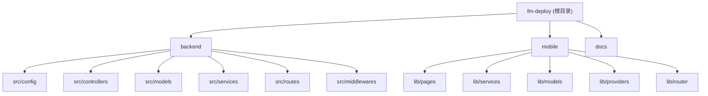

# FM Deploy - 项目自动化部署系统

> AI 上下文文档 | 最后更新: 2025-12-01T10:20:34+08:00

## 项目愿景

FM Deploy 是一个基于 Flutter + Node.js 的移动端项目自动化部署系统，旨在为开发团队提供简洁、高效的一键部署解决方案。支持前端和后端项目的自动化部署、实时日志查看和版本回滚功能。

## 架构总览

- **后端服务 (backend)**: Node.js + Express + TypeScript + TypeORM
- **移动端应用 (mobile)**: Flutter + Riverpod 状态管理
- **数据库**: MySQL (TypeORM)
- **缓存/队列**: Redis + Bull
- **实时通信**: WebSocket (Socket.IO)
- **部署模式**: Push 模式 (本地构建上传) 和 Pull 模式 (远程拉取构建)

## 模块结构图



## 模块索引

| 模块 | 路径 | 语言 | 职责 | 文档 |
|------|------|------|------|------|
| backend | `backend/` | TypeScript | Node.js 后端 API 服务 | [CLAUDE.md](./backend/CLAUDE.md) |
| mobile | `mobile/` | Dart/Flutter | 跨平台移动端应用 | [CLAUDE.md](./mobile/CLAUDE.md) |
| docs | `docs/` | Markdown | 项目文档 | - |

## 运行与开发

### 环境要求

**后端**:
- Node.js >= 18.0.0
- MySQL / PostgreSQL
- Redis >= 6.0

**移动端**:
- Flutter SDK >= 3.16.0
- Dart >= 3.2.0

### 快速启动

```bash
# 后端
cd backend
npm install
cp .env.example .env  # 配置环境变量
npm run dev

# 移动端
cd mobile
flutter pub get
flutter run
```

### 常用命令

| 命令 | 模块 | 说明 |
|------|------|------|
| `npm run dev` | backend | 启动开发服务器 |
| `npm run build` | backend | 构建生产版本 |
| `npm run migrate` | backend | 运行数据库迁移 |
| `npm run seed` | backend | 运行种子数据 |
| `flutter run` | mobile | 启动移动应用 |
| `flutter build apk` | mobile | 构建 Android APK |
| `flutter build ios` | mobile | 构建 iOS 应用 |

## 测试策略

- **后端**: 计划使用 Jest 进行单元测试和集成测试
- **移动端**: Flutter Test 框架

```bash
# 后端测试
cd backend && npm test

# 移动端测试
cd mobile && flutter test
```

## 编码规范

### TypeScript (后端)

- 使用 ESLint + Prettier 进行代码规范
- 遵循 TypeScript 严格模式
- 使用 TypeORM 实体装饰器定义数据模型
- API 响应统一格式: `{ success: boolean, data?: any, error?: string }`

### Dart/Flutter (移动端)

- 使用 flutter_lints 进行代码检查
- 状态管理采用 Riverpod
- 路由管理使用 go_router
- 网络请求封装使用 Dio

## AI 使用指引

### 代码生成建议

1. **后端 API**: 参考 `backend/src/controllers/` 下的控制器结构
2. **数据模型**: 参考 `backend/src/models/` 下的 TypeORM 实体定义
3. **Flutter 页面**: 参考 `mobile/lib/pages/` 下的页面结构
4. **服务层**: 后端参考 `backend/src/services/`，移动端参考 `mobile/lib/services/`

### 关键文件

- 后端入口: `backend/src/index.ts`
- 后端路由: `backend/src/routes/index.ts`
- 移动端入口: `mobile/lib/main.dart`
- 移动端路由: `mobile/lib/router/app_router.dart`

### 注意事项

1. SSH 密钥文件不要提交到代码仓库
2. 环境变量通过 `.env` 文件配置
3. 部署服务支持两种模式: Push (本地构建) 和 Pull (远程构建)

## 变更记录 (Changelog)

### 2025-12-01
- 初始化 AI 上下文文档
- 创建根级和模块级 CLAUDE.md
- 生成 .claude/index.json 索引文件
